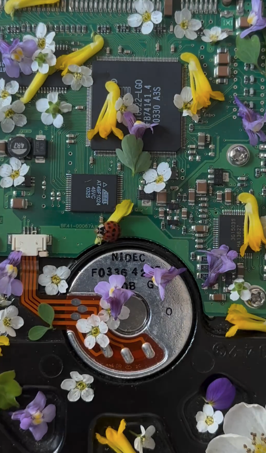

<!DOCTYPE html>
<html>
<head>
    <link rel="stylesheet" href="https://cdn.jsdelivr.net/gh/devicons/devicon@v2.15.1/devicon.min.css"/>
</head>
<body>
    

        
    

    

        <h1>Hi! Nice to meet you, I'm Andrés Martínez 👋</h1>
        <samp>
            <strong>CS Student @ ITESM</strong>
            
I am a Second-Year Computer Science Student at Tecnologico de Monterrey, Campus Sonora Norte. My main goal is to create a better world for everyone.

            <ul>
                <li>🖥️ Tech Enthusiast</li>
                <li>🎓 Self-taught programmer</li>
                <li>🌱 Currently learning <code>Data Structures & Algorithms</code></li>
            </ul>
            
You can contact me on LinkedIn: <a href="https://www.linkedin.com/in/andrés-daniel-mart%C3%ADnez-bermúdez-997b17249/" target="_blank">Andrés Daniel</a>

        </samp>
        

        

            
        

    

    

        
        
        
        
        
        
        
        
        
        
        
        
        
        
        
        
        
        
        
        
        
    

</body>
</html>
